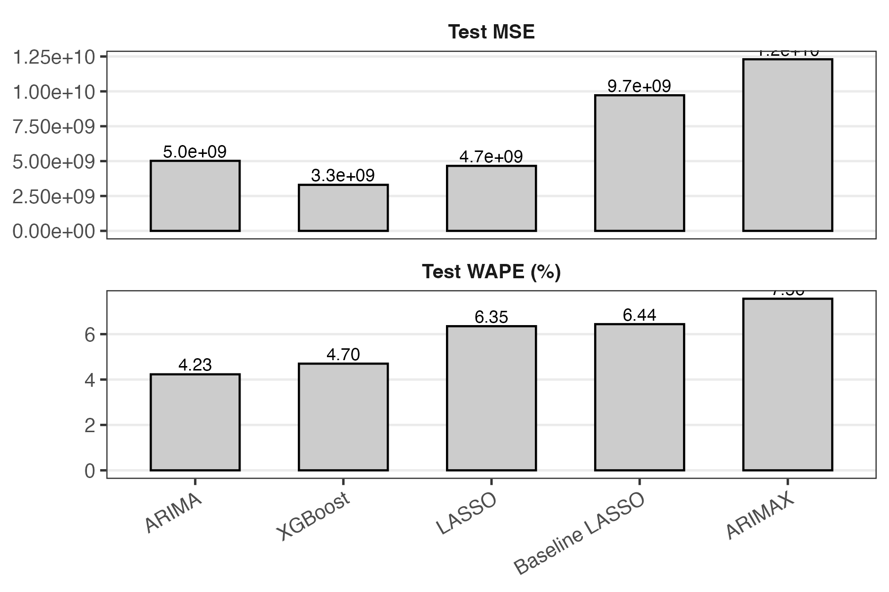

# STAT 527 Final Project  
## Retail Sales Forecasting: Time-Series Variable Selection on Walmart Data

This repository contains the code and artifacts for our STAT 527 final project on
**store-level weekly sales forecasting** and **variable selection** using the Walmart
Kaggle dataset.

We compare several forecasting models on a leakage-safe, feature-engineered
time-series panel:

- **Baseline LASSO** with only original covariates  
- **LASSO with engineered lag/seasonal features**  
- **XGBoost** gradient boosted trees  
- **ARIMA** (univariate)  
- **ARIMAX** with exogenous covariates  

The primary goals are to:
1. Quantify out-of-sample accuracy across methods, and  
2. Understand which covariates are consistently selected as important drivers of sales.

Our main evaluation metrics are **WAPE (Weighted Absolute Percentage Error)** and
**MSE** on a **held-out test window** using expanding-window time-series
cross-validation for model selection.

---

## Data

We use the public Walmart weekly sales dataset (45 stores over ~3 years).  
Core fields include:

- `Weekly_Sales` (target), `Store`, `Date`, `Holiday_Flag`,  
- `Temperature`, `Fuel_Price`, `CPI`, `Unemployment`.

We engineer **leakage-safe features** per store:

- Lagged sales (1, 2, 4, 8 weeks), rolling means, expanding mean/sd  
- Fourier seasonal terms, month/quarter/week indicators  
- Interactions (e.g., holiday × lagged sales, CPI × unemployment)

---

## Methods (High-Level)

- **LASSO**  
  Linear regression with \(\ell_1\) regularization for sparse variable selection.
  We fit models with and without the engineered feature set.

- **XGBoost**  
  Gradient boosted trees over all features, capturing nonlinearities and
  interactions. Feature importance is based on gain.

- **ARIMA / ARIMAX**  
  Store-specific time-series models chosen by `auto.arima`, with and without
  exogenous regressors.

All hyperparameters are tuned via **expanding-window cross-validation**, then
models are refit on train+validation and evaluated once on the final test window.

---

## Key Figures and Demo

These three artifacts summarize the project at a glance.

### 1. Aggregate Sales Over Time

Total weekly sales across all stores. This highlights strong seasonality and
holiday spikes that motivate our lagged and seasonal feature engineering.

---

### 2. Final Test Performance

Top panel: **Test MSE** by model.  
Bottom panel: **Test WAPE (%)** by model.

The figure indicates that XGBoost achieves the strongest overall performance, outperforming the other methods on both evaluation metrics.

---

### 3. Interactive Shiny Demo

Animated walkthrough of the Shiny app used to explore the models.

The app lets users:

- Select a **store** and **history window**  
- View the **best-WAPE** and **most sparse** models  
- Visualize **train vs. test forecasts** and inspect how predictions change
  across stores and models.

The app is intended as a teaching and exploration tool and uses the same
trained models and hyperparameters reported in the paper.

---

## Reproducibility (Sketch)

1. **Install dependencies**  
   - R (with `glmnet`, `forecast`, `xgboost`, `shiny`, `tidyverse`, etc. see model notebooks for detail.)
2. **Obtain data**  
   - Download the Walmart dataset from Kaggle and place it under `data/`
     as described in the scripts.
     - Walmart Retail: https://www.kaggle.com/datasets/yasserh/walmart-dataset/data
3. **Run pipelines**  
   - Preprocess and engineer features  
   - Train each model (LASSO variants, XGBoost, ARIMA/ARIMAX)  
   - Recompute WAPE/MSE and regenerate the figures above.
4. **Launch the Shiny app (optional)**  
   - Run the app script (see `demo/`) to interactively explore forecasts.

For exact scripts and command sequences, see the comments in the R files and
the accompanying report.
